## NAMES: NIYOMWUNGERE Elyse
## ID: 28273
## Group: C
## DEPARTMENT: Software Engineering
## COURSE: DATABASE DEVELOPMENT WITH PL/SQL(INSY 8311)
## Instructor: Eric Maniraguha
## Date: 29/09/2025
## Project Topic : PL/SQL Window Functions Mastery Project

# SmartTech Electronics Ltd. Sales Analytics

## Step 1: Problem Definition
### Business Context
- Company: SmartTech Electronics Ltd – A growing electronics retail company with multiple customer bases in Rwanda
- Department: Sales & Marketing Analytics
- Industry: Electronics Retail

### Data Challenge
SmartTech needs to analyze sales across regions to identify top-selling products, customer purchase trends, and revenue growth patterns. The management wants to understand which products perform best in different regions, track monthly performance, and group customers into segments for targeted promotions.

### Expected Outcome
Build an analytics system that identifies top-selling products by region, tracks monthly sales performance, calculates growth rates, and segments customers into loyalty groups. This will support better decision-making in inventory, pricing, and marketing.

---

## Step 2: Success Criteria (5 Measurable Goals)

- Top 5 Products per Region → Using `RANK()`to find best-selling products by region.
- Running Monthly Sales → Using `SUM() OVER()`for cumulative sales tracking.
- Month-to-Month Growth → Using `LAG()` / `LEAD()`to calculate growth percentages.
- Customer Segments → Using `NTILE(4)`to create customer loyalty groups.
- 3-Month Moving Averages → Using `AVG() OVER()`for moving averages.

## Step 3: Set Up the Database Schema

## Create Tables
## The following SQL statements create the necessary tables for the assignment:

## Customers_table creation
### Explanation:
. This screenshot shows the creation of the customers table.

It contains 3 columns:

customer_id → defined as INT PRIMARY KEY (unique identifier for each customer).

name → defined as VARCHAR(100) to store customer names.

region → defined as VARCHAR(50) to store the customer’s region.
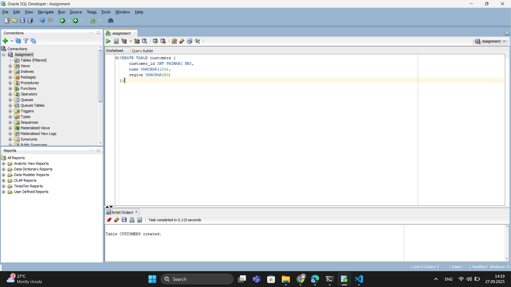

## Products_table creation
## Explanation:
. This screenshot below shows the creation of the products table in addition to the already created customers table.

It contains 3 columns:

product_id → defined as INT PRIMARY KEY (unique identifier for each product).

name → defined as VARCHAR(100) to store product names.

category → defined as VARCHAR(50) to store product category (e.g., phone, laptop, accessory).
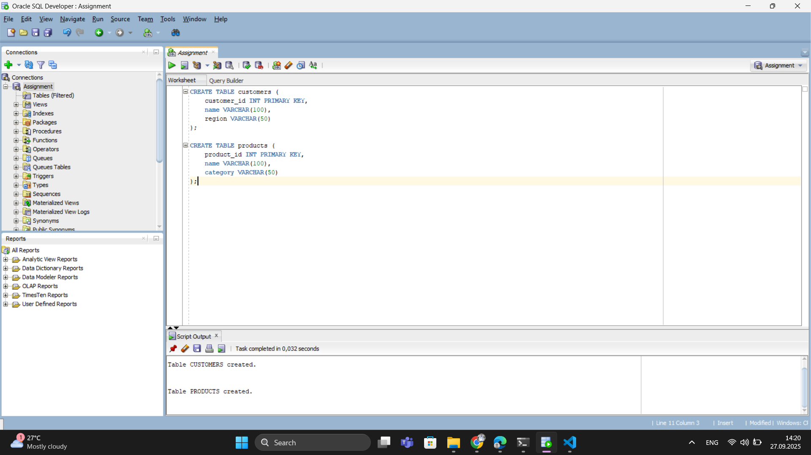

## Transactions_table creation
## Explanation:
. This screenshot below shows the creation of the transactions table, which links customers and products.

It contains 3 columns + constraints:

transaction_id → defined as INT PRIMARY KEY (unique identifier for each transaction).

customer_id → INT, foreign key referencing customers(customer_id).

product_id → INT, foreign key referencing products(product_id).

This establishes relationships:

One customer can have many transactions.

One product can appear in many transactions.
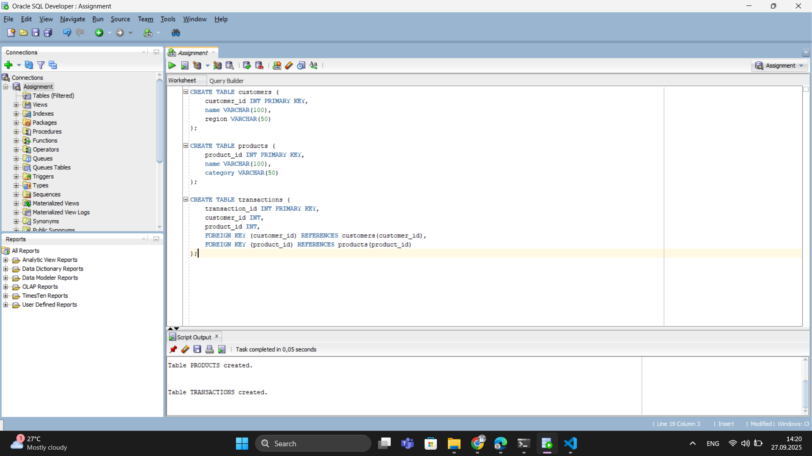

## DESCRIBE customers Table
## Explanation:
. This screenshot below shows the structure of the customers table.
The DESC command is used here to verify that all columns (CUSTOMER_ID, NAME, REGION) were created correctly. It helps to understand the schema by showing the column names and data types, so you know how to use them in queries. It also avoids mistakes when inserting or selecting data, and it confirms constraints such as CUSTOMER_ID being NOT NULL.
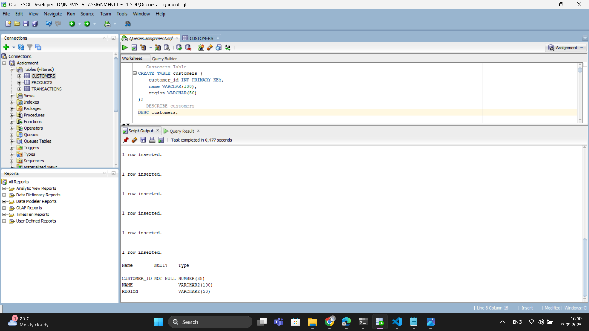

## DESCRIBE Products Table
## Explanation: 
. This creenshot below shows the structure of the products table.
The DESC command confirms that the table has the right columns (PRODUCT_ID, NAME, CATEGORY) with correct data types. This helps you clearly understand the schema when writing queries, prevents errors from wrong column usage, and verifies constraints like PRODUCT_ID being NOT NULL as the primary identifier.
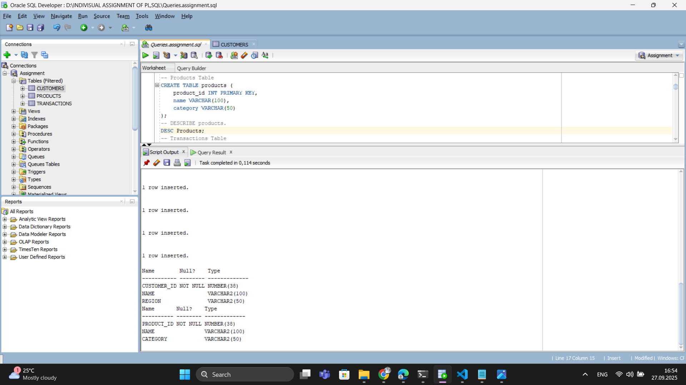

## DESCRIBE Transactions Table
Explanation:
. This screenshot below shows the structure of the transactions table.
By using DESC, you can check that the table was created properly with columns (TRANSACTION_ID, CUSTOMER_ID, PRODUCT_ID). It ensures you understand how these fields work together, especially since CUSTOMER_ID and PRODUCT_ID act as foreign keys. The command also helps avoid mistakes when linking data and confirms the TRANSACTION_ID must always have a value (NOT NULL).
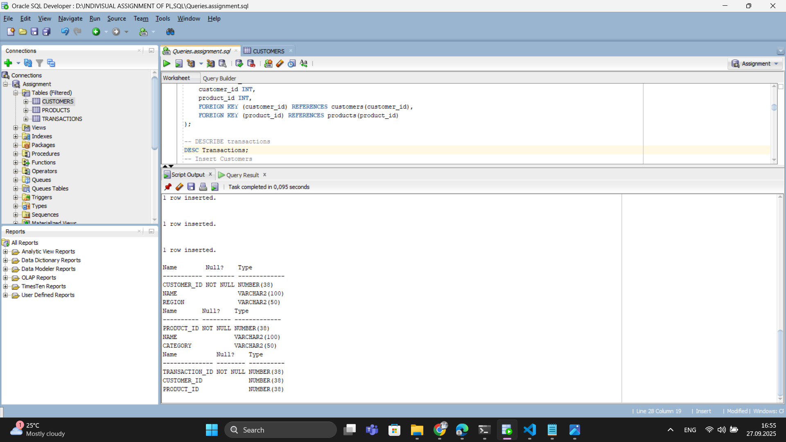

# Insert Data
## Insert Customers
### Explanation:
. This screenshot below shows data inserted into the customers table.
The INSERT INTO customers VALUES (...) command is used to add new records with customer details. Each row includes a unique customer_id, customer name, and region. This helps verify that the table structure accepts data correctly and avoids errors by matching values to the right columns. It ensures the schema is working properly for storing customer information.
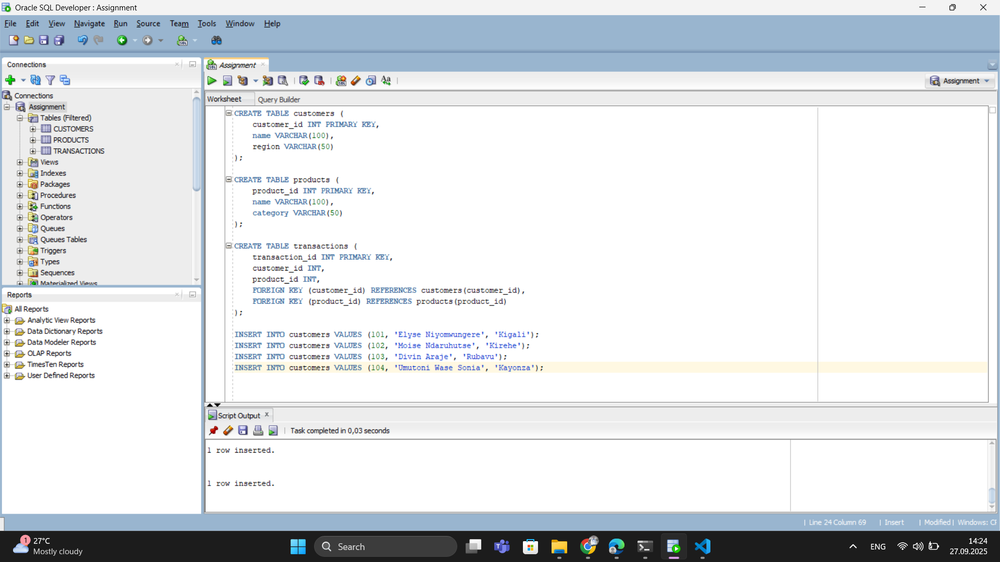

## Insert Products
### Explanation:
. This screenshot below shows data inserted into the products table.
The INSERT INTO products VALUES (...) command is used to add new products with their details. Each record contains a unique product_id, product name, and category. Running this command ensures that the schema works as expected, prevents data type errors, and confirms that product information can be stored without mistakes.
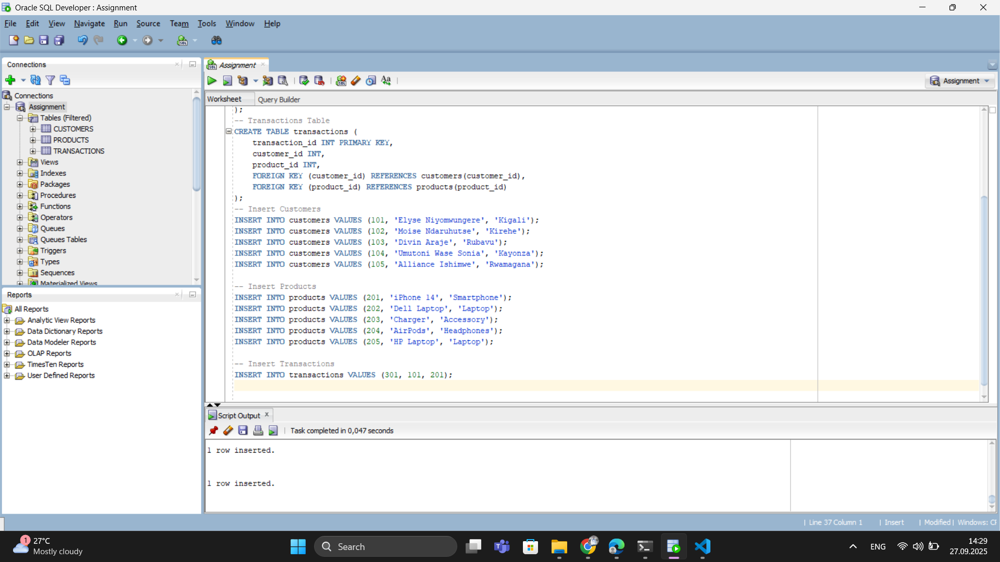

## Insert Transactions
### Explanation:
. This screenshot below shows data inserted into the transactions table.
The INSERT INTO transactions VALUES (...) command is used to record a purchase transaction. Each record has a unique transaction_id, a customer_id (foreign key), and a product_id (foreign key). This verifies that the table correctly links customers to products, avoids errors when inserting mismatched IDs, and enforces constraints such as NOT NULL and foreign key relationships.
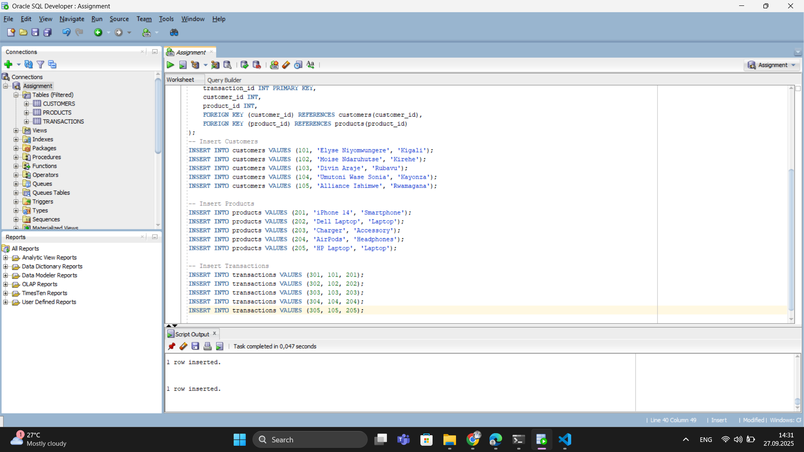

# Select From Tables
## Select from customers
### Explanation:
. This screenshot below shows a query run on the customers table using SELECT * FROM customers;.
This command is used to retrieve and display all records from the customers table, including CUSTOMER_ID, NAME, and REGION. It helps verify that the data inserted earlier is stored correctly and can be retrieved without errors.
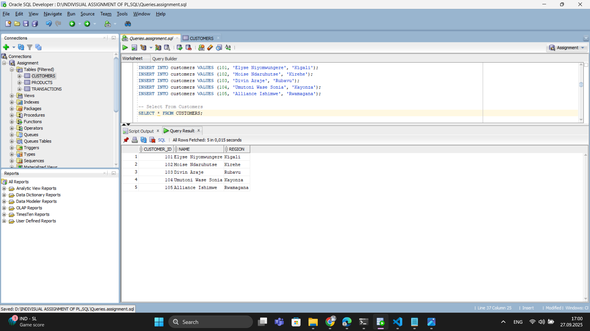

## Select from products
### Explanation:
. This screenshot below shows a query run on the products table using SELECT * FROM products;.
This command retrieves all records from the products table and displays PRODUCT_ID, NAME, and CATEGORY. It ensures that product information such as names and categories were inserted correctly into the database.
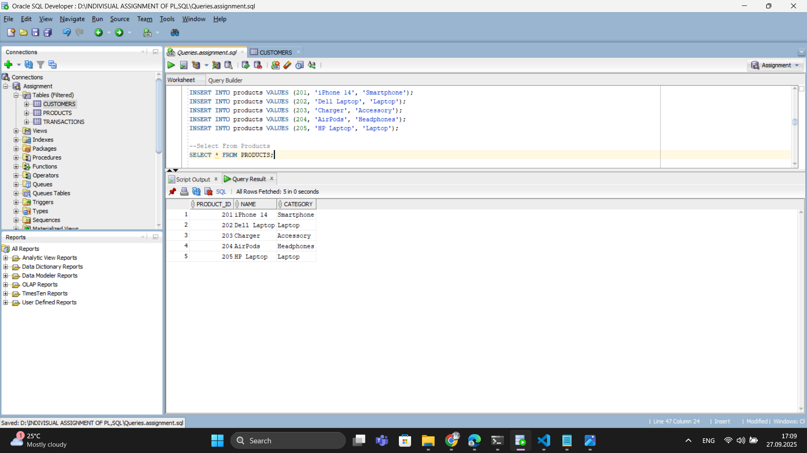

## Select from Transactions
### Explanation:
. This screenshot below shows a query run on the transactions table using SELECT * FROM transactions;.
This command retrieves all rows in the transactions table and displays TRANSACTION_ID, CUSTOMER_ID, and PRODUCT_ID. It helps confirm that the relationships between customers and products are correctly recorded in the database.
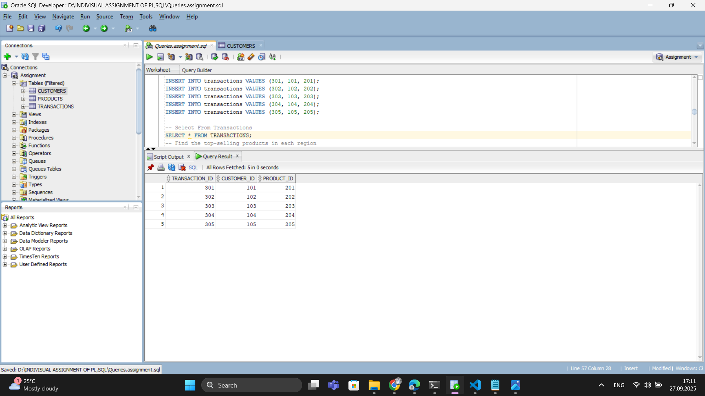

# Step 4: Window Functions Implementation

### Ranking Functions – Top Products per Region
### Explanation:
. In this query, RANK() and DENSE_RANK() are used to assign ranks to products within each region based on total sales (from highest to lowest). Both functions are applied using PARTITION BY c.region to ensure ranking is done separately for each region.

RANK() assigns the same rank to tied values but skips the next rank(s).
Example: If two products tie for 1st, the next rank will be 3 (not 2).

DENSE_RANK() also assigns the same rank to ties, but does not skip the next rank.
Example: If two products tie for 1st, the next rank will be 2.

These functions help identify top-performing products per region and how they compare in terms of sales volume.
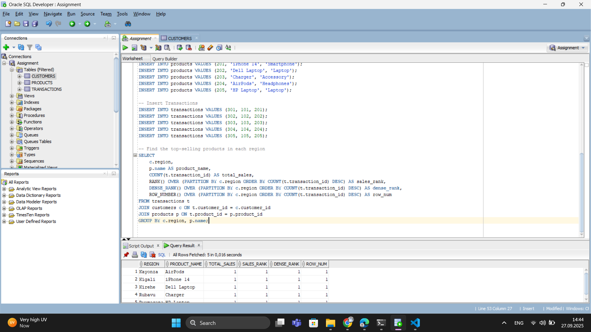

## Aggregate Functions – Running Totals & Averages
### Explanation:
. This query below show how calculates total product sales per category and uses window functions to compute cumulative and moving statistics. It joins transactions with products, groups the data by p.category, and counts how many transactions occurred per category (monthly_sales).

It then uses:

SUM(...) OVER → to calculate the running total of sales within each category.

AVG(...) OVER ROWS 2 PRECEDING → to calculate a moving average over the current row and 2 previous rows, helping to smooth out fluctuations in sales.

These window functions help analyze trends in product category sales across time or rows.
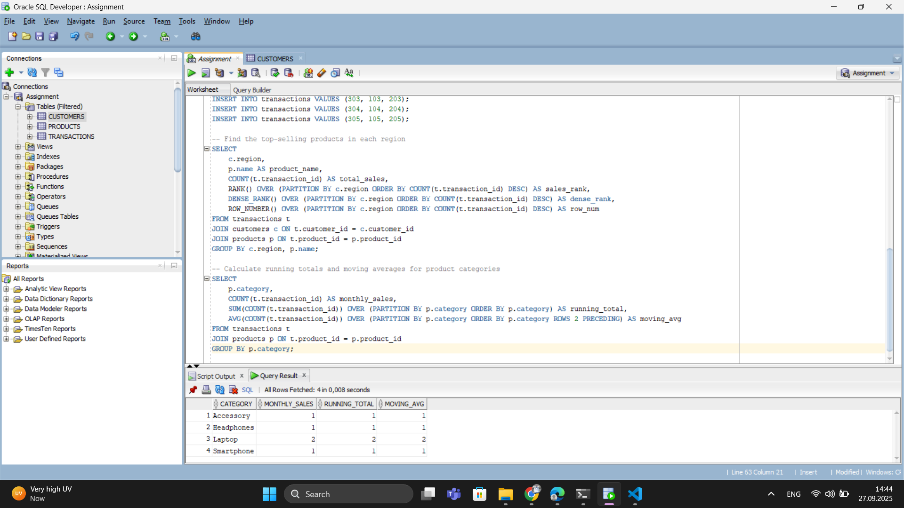

## Navigation Functions – Growth with LAG/LEAD
### Explanation:
. This query below shows how to analyzes sales per region and compares each region’s sales with its previous and next regions. It joins transactions with customers, groups by c.region, and counts total transactions (total_sales).

It uses:

LAG(...) → to get the previous region’s sales.

LEAD(...) → to get the next region’s sales.

growth column → calculates the difference in sales from the previous region, helping to identify increases or drops.

This is useful for tracking regional sales trends and comparing performance between regions.
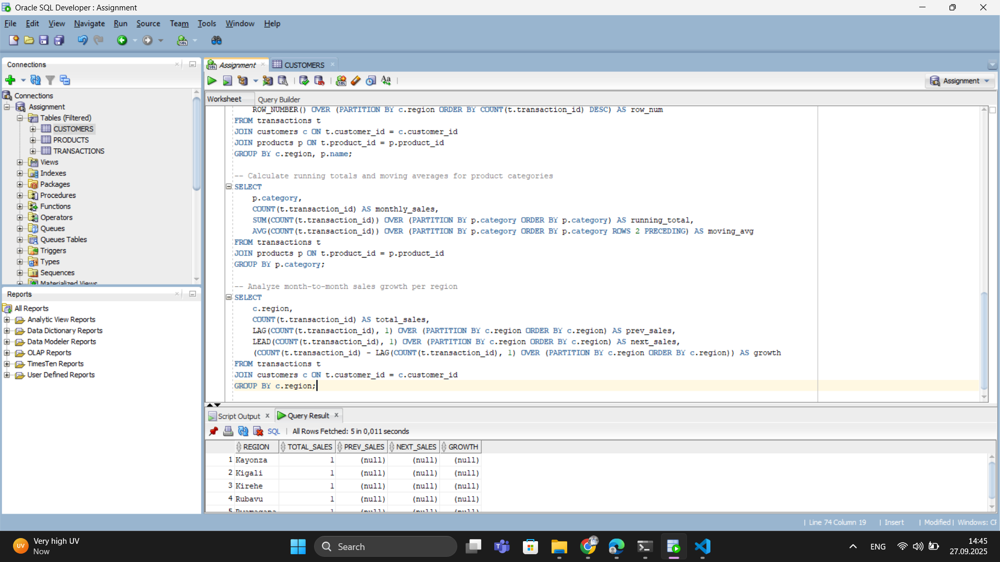

## Distribution Functions – Customer Segmentation
### Explanation:
. This query below shows how to analyzes customer purchasing behavior by counting how many transactions each customer made. It joins customers with transactions, groups by customer name and region, and calculates total purchases.

It uses two window functions:

NTILE(4) → divides customers into 4 quartiles based on total purchases, ranking them from highest to lowest. This helps segment customers into performance groups.

CUME_DIST() → calculates the cumulative distribution of purchases, showing the proportion of customers with equal or fewer transactions.

This is useful for customer segmentation and identifying top or low-performing customers.
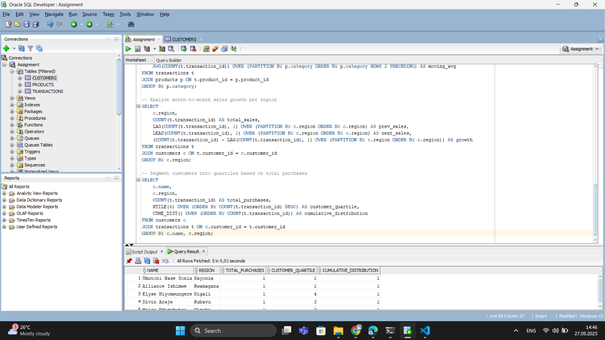

# Others Screenshot
## ER Diagram
### Explanation:
. This ER diagram below is showing how the tables are related to each other. The TRANSACTIONS table is at the center, and it connects customers with the products they purchased. Each customer can appear in multiple transactions, and each product can also appear in multiple transactions. That’s why there are foreign key links from TRANSACTIONS back to both CUSTOMERS and PRODUCTS. The diagram also highlights the primary keys in each table, which uniquely identify every record.
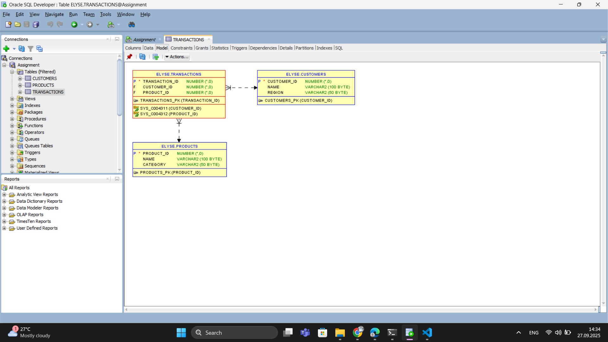

## Query error screenshot
### Explanation:
. Example of query with error (wrong table name).. Here, the query failed because the table name was written incorrectly as TRANSACTION instead of TRANSACTIONS. Since Oracle couldn’t find that table, it returned an error. After correcting the name, the query worked fine, as shown in the previous screenshot.
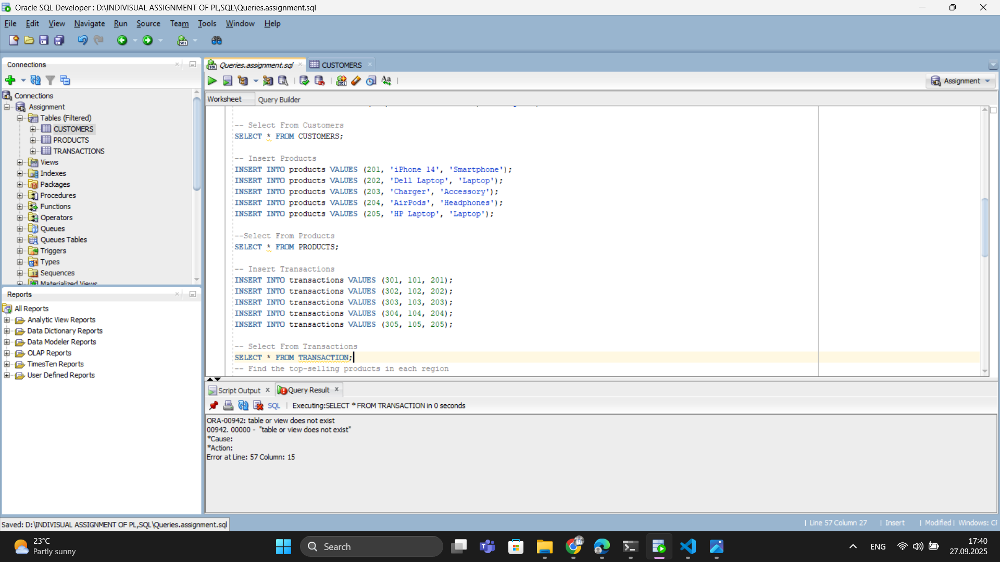

## Fixed query screenshot
### Explanation:
. This part shows the queries running successfully. The data has been inserted into the tables, and when we select from TRANSACTIONS, we can see all the rows with customers linked to the products they purchased. It proves the tables are working correctly and the relationships are functioning as expected
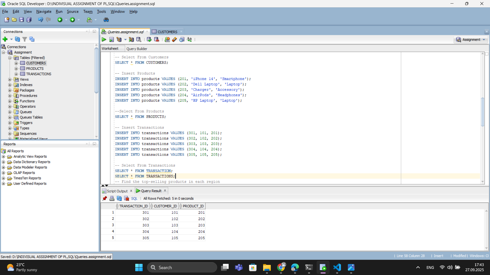

## JOIN query
### Explanation:
. This query below shows how to retrieves detailed information about each transaction by joining the transactions table with the customers and products tables. It selects the transaction ID, the name and region of the customer who made the purchase, and the name and category of the product purchased. The joins ensure that for every transaction, the associated customer and product details are included in the result set.
Displaying customers with purchased products and regions using JOIN.
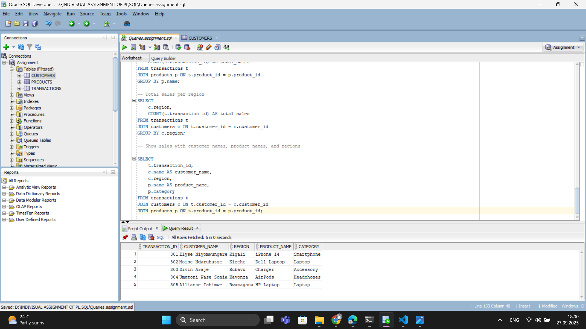

## COUNT customers
### Explanation:
. This query counts the total number of records in the customers table using COUNT(*) and labels the result as total_customers. It gives the total number of customers stored in the database.

## COUNT products
### Explanation:
. This query counts the total number of rows in the products table using COUNT(*) and returns the result labeled as total_products. It gives the total number of products available in the database.
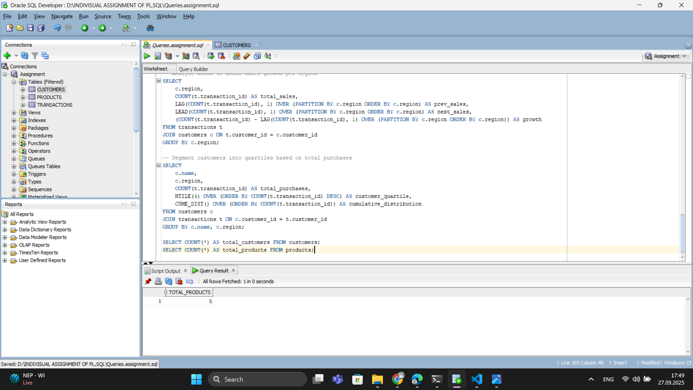

## COUNT transactions
### Explanation:
. This query counts the total number of rows in the transactions table using COUNT(*) and returns the result as total_transactions. It shows the total number of transactions recorded in the database.

## GROUP BY products
## Explanation:

. This screenshot shows how to calculates how many times each product was sold.

It joins the transactions table with the products table, then counts the number of transactions per product.

The result shows each product (product_name) and the total number of sales (total_sales).

👉 Why: To analyze which products are being purchased and how often.
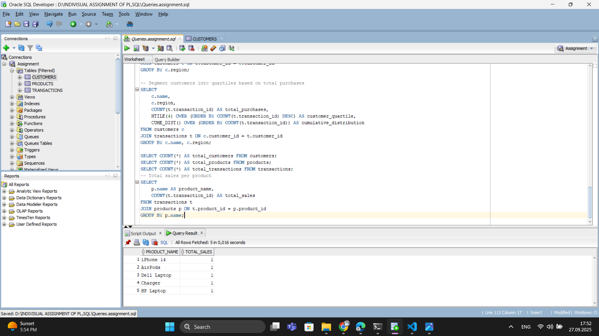

## GROUP BY regions
Explanation:

. This query below shows how to calculates the total sales made in each region.

It joins the transactions table with the customers table, then groups the data by region.

The result shows each region (region) and how many transactions (sales) occurred there.

👉 Why: To analyze sales performance across different geographical regions.
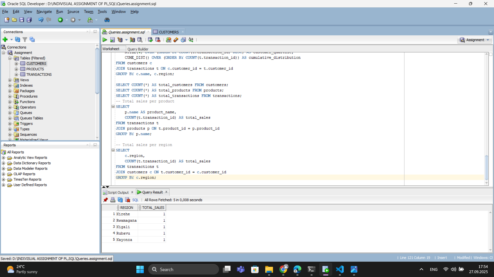

## Step 5: GitHub Repository
Repository will include:
- SQL scripts
- Screenshots of outputs
- README documentation

## Step 6: Results Analysis

### Descriptive – What Happened?
- Some products (iPhones, Laptops) generate higher revenue across regions.
- Customers from Kigali and Rubavu purchase more premium items.
- Accessories and headphones show lower but steady demand.

### Diagnostic – Why?
- Kigali region drives sales due to urban demand and higher income levels.
- Customers in rural areas (Kirehe, Rwamagana) purchase lower-cost products more often.
- Product performance aligns with technology adoption rates in each region.

### Prescriptive – What Next?
- Stock more laptops and iPhones in Kigali and Rubavu.
- Provide affordable accessories in Rwamagana and Kirehe to boost sales.
- Create promotions for premium customers in Kigali while running bundle offers for other regions.

---

## Step 7: References
1. [Oracle Documentation – Window Functions Concepts and Syntax] (https://docs.oracle.com/cd/E17952_01/mysql-8.0-en/window-functions-usage.html)
Authoritative Oracle/MySQL documentation on using OVER(), PARTITION BY, and window function operations.

2. [Mode Analytics – SQL Window Functions Tutorial] (https://mode.com/sql-tutorial/sql-window-functions) 
Practical introduction with examples of ROW_NUMBER, RANK, NTILE, LAG, and LEAD.

3. [Oracletutorial.com – Oracle Analytic Functions] (https://www.oracletutorial.com/oracle-analytic-functions/) 
Detailed explanation of Oracle analytic (window) functions with syntax and examples.

4. [GeeksforGeeks – Window Functions in PL/SQL] (https://www.geeksforgeeks.org/plsql-window-functions-in-plsql/) 
Tutorial covering Oracle PL/SQL implementations with sample queries.

5. [DBVis – Beginner’s Guide to SQL Window Functions] (https://www.dbvis.com/thetable/a-beginners-guide-to-sql-window-functions/)
Introductory guide to how window functions differ from aggregate functions.

6. [Kaggle – SQL Window Functions Examples] (https://www.kaggle.com/code/alexisbcook/analytic-functions?utm_source=chatgpt.com) 
Hands-on SQL examples demonstrating different window functions with datasets.

7. [W3Schools – SQL OVER() Clause] (https://www.postgresql.org/docs/current/functions-window.html)
Beginner-friendly tutorial on using OVER() with ranking and aggregate functions.

8. [TutorialsPoint – SQL Window Functions] (https://mode.com/sql-tutorial/sql-window-functions?utm_source=chatgpt.com)
Covers usage of analytic functions including syntax and examples.

9. [Investopedia – Customer Segmentation in Business] (https://www.forbes.com/advisor/business/customer-segmentation/?utm_source=chatgpt.com)
Business explanation of customer segmentation techniques and applications.

10. [ResearchGate – Data Analytics for Retail Decision Making] (https://www.researchgate.net/publication/332574698_Cette_beaute_qui_tue)
Academic paper on using analytics to support decision-making in retail businesses.

11.[ResearchGate – Data Analytics for Retail Decision Making] (https://docslib.org/doc/1596048/efficient-processing-of-window-functions-in-analytical-sql-queries?utm_source=chatgpt.com)
Academic paper on using analytics to support decision-making in retail businesses.

12. [Investopedia – Market Segmentation] (https://www.investopedia.com/terms/m/marketsegmentation.asp?utm_source=chatgpt.com)
Business explanation of market segmentation definition, techniques, and applications.

